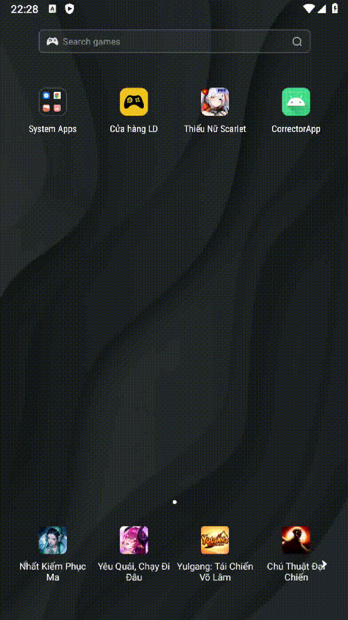
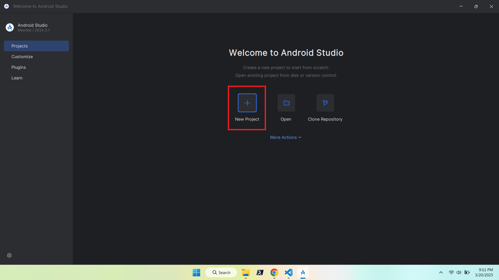
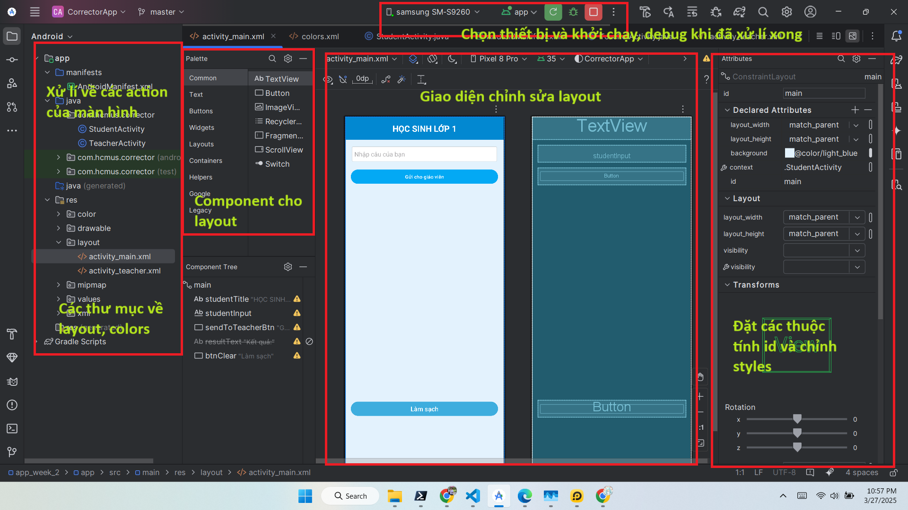
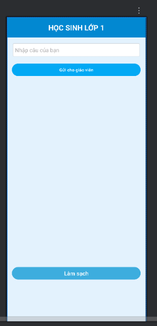
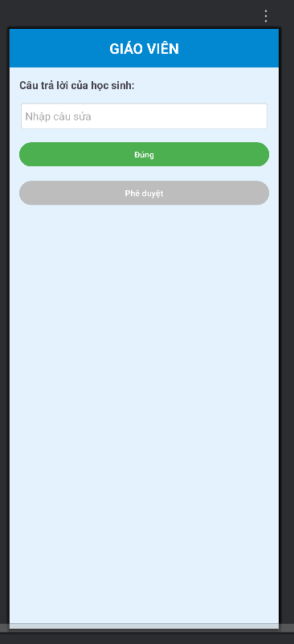

# 📱 Android App: Kiểm tra chính tả

Ứng dụng Android giúp giáo viên có thể chấm sửa lỗi và đưa ra kết quả đến học sinh

---
## 🎬 Chương trình ứng dụng và kiểm thử

---

##  🎬 Xem tại Youtube
[](https://youtu.be/DI3SbAJHxEQ)


---

## 🚀 1. Tạo Project mới trong Android Studio
Tạo một dự án mới trong **Android Studio**:


---

## 🏗️ 2. Chọn loại Activity
Chọn **Basic View Activity** để có giao diện cơ bản:


---

## ✏️ 3. Đặt tên project và chọn cấu hình Android
Nhập tên ứng dụng, package name, và chọn ngôn ngữ **Java/Kotlin**:


---

## 🖥️ 4. Màn hình chính trong Android Studio
Khi mở dự án, bạn sẽ thấy giao diện chính gồm **XML Layouts** và **MainActivity**:


---

## 🎨 5. Thiết kế giao diện (Layout)

### 🔹 Main Activity (Học sinh nhập câu)
Màn hình chính để nhập câu cần kiểm tra và gửi đến cho giáo viên:


### 🔹 Teacher Activity (Hiển thị kết quả)
Màn hình hiển thị **Kết quả đúng hay sai, nếu sai thì hiển thị thông tin giáo viên đã sửa lại câu đó**:


---

## ⚙️ 6. Cách hoạt động

1. **Học sinh nhập câu cần kiểm tra vào ô hộp thư**.
2. Sau khi nhập xong nhân nút**Gửi đến cho giáo viên**.
3. Giáo viên sẽ kiểm tra tại màn hình TeacherActivity và sửa lỗi nếu sai:
4. Hiển thị kết quả khi giáo viên đã kiểm tra được gửi đến lại cho Student trong **Main Activity**.

---

## 🛠️ 7. Cách chạy ứng dụng

1. Clone repo này về máy:
   ```sh
   git clone https://github.com/Trung78z/android-app_week_3.git
   ```
2. Mở **Android Studio** và import project.
3. Chạy ứng dụng trên **Emulator** hoặc **thiết bị thật**.
4. Nhập câu cần kiểm tra.


---

## 📩 8. Liên hệ
Nếu có thắc mắc hoặc góp ý, vui lòng liên hệ qua email: `quanh.0807@gmail.com` & `trungpspy@gmail.com`.